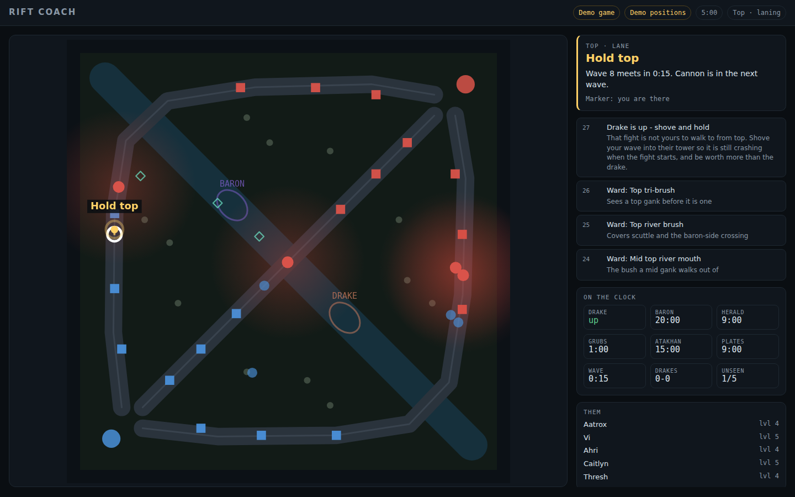
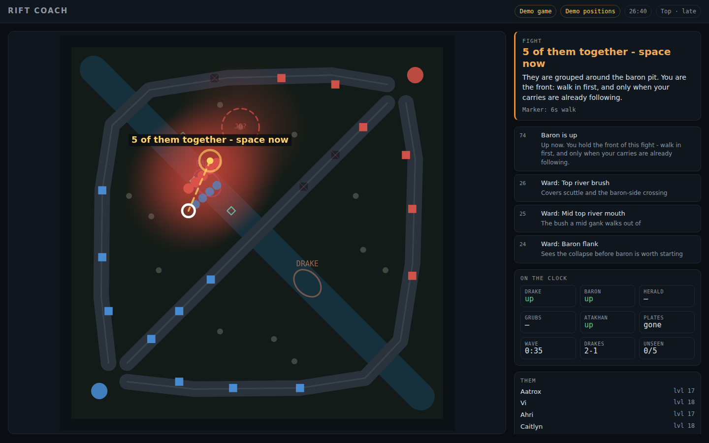

# Rift Coach

A real-time coach for League of Legends. It reads the game's own live data
endpoint and watches your minimap, and it answers one question continuously:

> **Where should I be standing right now, and why?**

It draws Summoner's Rift, puts a marker on it, draws a line from you to the
marker, and writes one sentence explaining the call. Under that sits everything
it used to decide: objective timers, the wave clock, how many of them are
unaccounted for, and a guess at where their jungler is.



---

## Running it

Node 18 or newer. There are no dependencies to install.

```bash
node server.mjs          # then open http://localhost:8777/
```

Start a game. The page connects itself — the chip in the corner turns from
"Not connected" to "Live game" a second after you load into the Rift.

**To see what it does without playing:**

```bash
node server.mjs --demo   # a scripted 30-minute game, replayed in real time
```

Demo mode also supplies positions, so the map is fully populated. It is the
fastest way to judge whether this is worth your time before you trust it with a
ranked game.

**Options**

| | |
|---|---|
| `node server.mjs --port=9000` | serve somewhere else |
| `node server.mjs --demo --from=900` | start the scripted game at 15:00 |
| `http://localhost:8777/?compact=1` | map and one instruction only, for a small window kept on top of the game |
| `npm test` | run the scenario suite |

---

## Teaching it where your minimap is

The game will not tell any program where the champions are — not yours, not
theirs. What it will do is draw them in the corner of your screen. So that is
what the coach reads: the pixels you are already looking at.

1. Click **Watch my minimap**. The browser asks which screen to share — pick the
   display League is on. (Not the browser window; there is nothing on that but
   this page.)
2. A calibration panel opens. Drag a box around your minimap. It snaps square.
3. Check the preview. Every champion on the minimap should get a circle: red
   for them, blue for your team, white for you. If circles are missing or
   landing on nothing, nudge **Sensitivity** and watch the preview respond.
4. **Save.** The rectangle is remembered, so this is a one-time job unless you
   change resolution or move your HUD.

If you play with the minimap flipped, tick **Minimap is flipped in game** —
otherwise every call comes out rotated half a turn, which is worse than no calls
at all.

Without capture the coach still works. It keeps the clock, the objective timers,
the wave timings, the recall windows and the scoreboard advice; it just cannot
say anything about where anybody is standing, including you.

---

## What it reads, and what it does not

**It reads two things.**

The **Live Client Data API** — `https://127.0.0.1:2999/liveclientdata/allgamedata`
— is an endpoint the game itself serves to anything running on your machine.
This is the sanctioned route, the one overlays and stream widgets are built on.
It gives the clock, every player's champion, level, items, score and death
timer, and the full event log: dragons, barons, grubs, turrets, kills.

Your **screen**, via the browser's own screen-sharing prompt, which you click
yourself and can revoke at any time from the browser's sharing bar.

**It does not** read the game's memory, inject anything into the client, hook
any API, automate any input, or send a single byte off your machine. The only
outbound request `server.mjs` makes is to `127.0.0.1`. There is no account,
no telemetry, and no second request.

That said: read your own region's rules and decide for yourself what you are
comfortable running alongside a competitive game. Reading a screen you are
looking at is the least invasive way to do this, and it is still a tool that
tells you things while you play.

---

## What the advice is actually made of

There is no model here, and deliberately so. Real-time advice has to arrive in
tens of milliseconds and has to be explainable when it is wrong. So the coach is
a rule set — thirteen rules, each of which reads the whole board and either says
something or stays quiet, each scoring itself out of a hundred on an absolute
scale. The highest score that names a place on the map becomes the marker.

When it tells you something you disagree with, exactly one rule said it, and you
can go and read that rule in [`src/coach/rules.js`](src/coach/rules.js).

The rules, roughly in the order they tend to fire:

- **Dead** — what to buy for, and where to walk when you are up, given what
  spawns while you are gone.
- **Outnumbered / blind** — more of them than of you within reach, or too much
  of the map unaccounted for while you are standing in their half. An enemy
  laner standing in their own lane is *not* danger; being able to tell the
  difference is most of what this rule is for.
- **Their jungler is on you** — from the prediction described below.
- **Somebody is dead** — a window, with how long it lasts and what to spend it on.
- **Objectives** — the pit, forty-five seconds before it matters rather than
  after, positioned by the line you hold in a fight.
- **Fight spacing** — when three or more of them are visible and grouped, where
  a front, middle, back or flanking champion should be relative to them.
- **Lane** — where the wave meets, when the next one lands, when the cannon
  comes.
- **Recall** — a timing question, not a health question: whether the wave gives
  you enough time to go home and be back before it arrives.
- **Plates**, **roams**, **jungle routes**, **mid-game shape** (group or push a
  side lane), and **ward spots** for the phase you are in and the ground you are
  standing on.



**Their jungler** is never known, only inferred. A jungle clear is a loop with a
direction: two sightings give you the direction, one sighting and a clock give
you a decent guess, and nothing gives you an honest shrug. The guess decays and
the circle on the map grows with it, because a confident dot ninety seconds
after the last sighting is worse than no dot — a laner will trust it and walk
into the lane brush on the strength of it.

**Danger** distinguishes what you can see from what you cannot. A visible enemy
is a fact; an enemy who left the minimap ten seconds ago is a growing circle
with your name in the middle of it.

---

## Patches move these numbers

Every timing the coach reasons with lives in one table:
[`src/model/patch.js`](src/model/patch.js). Baron's first spawn, drake respawn,
grub windows, when plates fall, how long death costs at each level. Nothing
downstream hardcodes a timing.

When the coach starts being a minute out, that file is the fix, and it is the
only file that needs to be.

---

## Layout

```
server.mjs              static files, and the one bridge to League
index.html  styles.css  the page

src/model/patch.js      every timing, in one editable table
src/model/rift.js       the map as coordinates: lanes, camps, pits, ward spots
src/model/roles.js      what you play, and what that means about where you stand

src/live/feed.js        the Live Client Data API, normalised
src/live/timeline.js    events already happened -> what is about to happen

src/vision/capture.js   screen share, calibration, cropping the minimap
src/vision/detect.js    champion icons out of 160x160 pixels
src/vision/tracker.js   dots across frames -> contacts with a last-seen time

src/coach/engine.js     one pure function: board in, ranked advice out
src/coach/rules.js      the advice itself
src/coach/wave.js       the minion clock, and recall windows
src/coach/jungle.js     where their jungler probably is
src/coach/threat.js     how dangerous a place is, as a number

src/ui/map.js           the Rift, drawn
src/ui/hud.js           the words next to it
src/ui/calibrate.js     the one-time drag

tools/coach-test.mjs    scenarios, timings, map symmetry, minimap reading
tools/demo-game.mjs     a game that never happened, in the shape of one that did
tools/scenarios.mjs     boards the tests assert against
```

The engine is a pure function over plain objects and imports nothing from the
DOM, which is what makes `npm test` possible: the test harness calls exactly
what the browser calls, several times a second.

```
$ npm test
  early-lane           -> lane           Hold mid
  deep-and-blind       -> danger         5 unaccounted for
  drake-spawning       -> drake          Drake is up
  soul-point           -> pick           2 down - take Baron
  baron-fight          -> fight          4 of them together - space now
  dead-before-baron    -> dead           Dead - back in 0:38
  recall-window        -> recall         Recall now - 0:06 spare
  ...
  115/115 checks passed
```

---

## Known limits

- **It cannot tell you which enemy is which.** The minimap says red, not
  "Caitlyn". So it counts, and it tracks, and it says "three unaccounted for" —
  which is the number that actually changes decisions.
- **Their jungler is a heuristic**: the enemy standing off-lane is taken for the
  jungler. Wrong sometimes; wrong in the direction of a wider circle rather than
  a confident lie.
- **Wave position is inferred** from where you have been standing, not from the
  minions, which are not drawn on the minimap.
- **It is coaching, not commands.** It does not know your cooldowns, your
  matchup, or that you are two levels down and cannot walk up to that wave.
